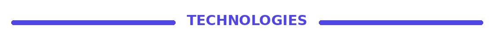
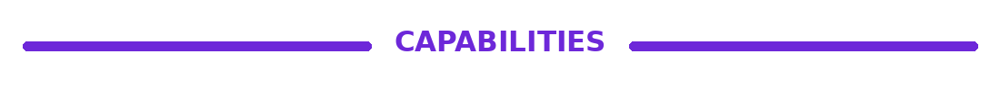
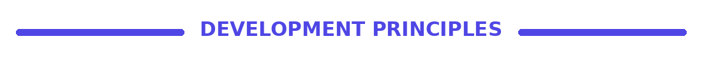
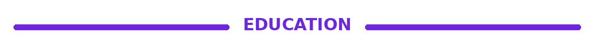
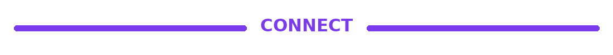

 

&nbsp;

&nbsp;

&nbsp;

  

Frontend Developer • Computer Programming Graduate

Building responsive, polished, and user-focused digital experiences.

 

 

<table>
<tr>
<td width="34%" valign="top">

Quick Profile

Computer Programming Graduate Frontend Development JavaScript & React Responsive Web Design Modern UI Development Based in Canada Open to IT Opportunities

</td>
<td width="66%" valign="top">

I am a Computer Programming graduate from Georgian College with a strong interest in frontend development, responsive design, and modern user interfaces.

I enjoy transforming ideas into clear, polished, and functional web experiences using HTML, CSS, JavaScript, React, and Bootstrap.

My work focuses on clean structure, thoughtful spacing, responsive layouts, and practical interactions that make websites easy to understand and enjoyable to use.

I continue to strengthen my technical skills through hands-on projects, code refinement, deployment, and continuous learning.

</td>
</tr>
</table>

 

Frontend

  

Programming & Database

  

Tools & Deployment

  

 

GitHub Overview

&nbsp;

  

 

<table>
<tr>
<td width="33%" valign="top" align="center">

 Responsive UI

Modern layouts that adapt smoothly across desktop, tablet, and mobile screens.

</td>
<td width="33%" valign="top" align="center">

 Clean Structure

Organized files, reusable sections, and readable code that is easier to maintain.

</td>
<td width="33%" valign="top" align="center">

 Practical Interaction

JavaScript and React features that improve usability without adding unnecessary complexity.

</td>
</tr>
</table>

<table>
<tr>
<td width="33%" valign="top" align="center">

 Visual Consistency

Careful attention to typography, alignment, spacing, and color balance.

</td>
<td width="33%" valign="top" align="center">

 Repository Quality

Clear README files, live links, organized folders, and polished project presentation.

</td>
<td width="33%" valign="top" align="center">

 Continuous Growth

Every project is used to strengthen technical skills, design judgment, and confidence.

</td>
</tr>
</table>

 

My Workflow

<table>
<tr>
<td width="16%" align="center">

Understand

Clarify the goal and user need.

</td>
<td width="16%" align="center">

Plan

Organize the structure and layout.

</td>
<td width="17%" align="center">

Design

Define spacing, hierarchy, and visual direction.

</td>
<td width="17%" align="center">

Build

Develop the interface and functionality.

</td>
<td width="17%" align="center">

Test

Review responsiveness, links, and behaviour.

</td>
<td width="17%" align="center">

Refine

Improve the code, design, and documentation.

</td>
</tr>
</table>

 

My approach is simple: understand the purpose, plan the experience, build carefully, test thoroughly, and refine the final result.

I focus on creating interfaces that are not only visually appealing but also clear, responsive, practical, and easy to maintain.

 

<table>
<tr>
<td width="50%" valign="top">

Simplicity

Clear solutions are stronger than unnecessary complexity.

Readability

Code should remain organized, understandable, and easy to update.

Responsiveness

Every interface should work properly across different devices.

</td>
<td width="50%" valign="top">

Usability

The design should guide users clearly and reduce confusion.

Consistency

Repeated visual and structural choices create a polished experience.

Improvement

Every completed version can still be reviewed and strengthened.

</td>
</tr>
</table>

 

Computer Programming Diploma

Georgian College

 

My studies introduced me to programming, web development, databases, testing, software development practices, and technical problem-solving.

 

 

Current Focus

<table>
<tr>
<td width="33%" align="center">
 React Development

Building cleaner, reusable, and better-organized interface components.

</td>
<td width="33%" align="center">

 JavaScript Skills

Improving logic, interaction, debugging, and problem-solving.

</td>
<td width="33%" align="center">

 UI Quality

Refining responsiveness, accessibility, spacing, and user experience.

</td>
</tr>
</table>

 

 

  

I am currently open to opportunities where I can contribute, continue learning, and grow as a frontend or web developer.

  

  

  

  

  

